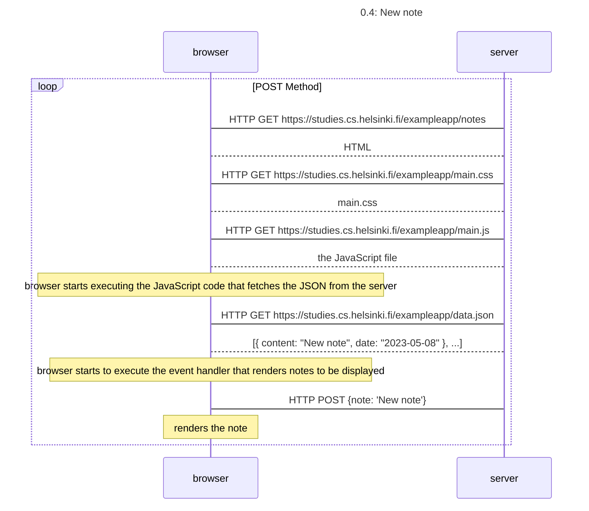

```mermaid
sequenceDiagram
    Title: 0.4: New note

    loop POST Method
        browser->server: HTTP GET https://studies.cs.helsinki.fi/exampleapp/notes
        server-->browser: HTML
        browser->server: HTTP GET https://studies.cs.helsinki.fi/exampleapp/main.css
        server-->browser: main.css
        browser->server: HTTP GET https://studies.cs.helsinki.fi/exampleapp/main.js
        server-->browser: the JavaScript file

        note over browser: browser starts executing the JavaScript code that fetches the JSON from the server

        browser->server: HTTP GET https://studies.cs.helsinki.fi/exampleapp/data.json
        server-->browser: [{ content: "New note", date: "2023-05-08" }, ...]

        note over browser: browser starts to execute the event handler that renders notes to be displayed

        browser->server: HTTP POST {note: 'New note'}

        note over browser: renders the note
    end
```
