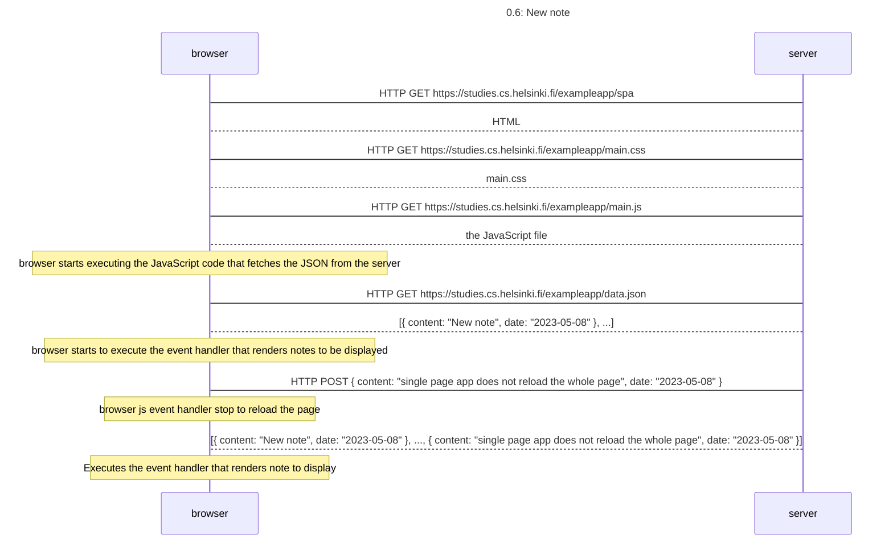

# 0.6: New note

```mermaid
sequenceDiagram
    Title: 0.6: New note

    browser->server: HTTP GET https://studies.cs.helsinki.fi/exampleapp/spa
    server-->browser: HTML
    browser->server: HTTP GET https://studies.cs.helsinki.fi/exampleapp/main.css
    server-->browser: main.css
    browser->server: HTTP GET https://studies.cs.helsinki.fi/exampleapp/main.js
    server-->browser: the JavaScript file

    note over browser: browser starts executing the JavaScript code that fetches the JSON from the server

    browser->server: HTTP GET https://studies.cs.helsinki.fi/exampleapp/data.json
        server-->browser: [{ content: "New note", date: "2023-05-08" }, ...]

    note over browser: browser starts to execute the event handler that renders notes to be displayed

    browser->server: HTTP POST { content: "single page app does not reload the whole page", date: "2023-05-08" }

    note over browser: browser js event handler stop to reload the page

    server-->browser: [{ content: "New note", date: "2023-05-08" }, ..., { content: "single page app does not reload the whole page", date: "2023-05-08" }]

    note over browser: Executes the event handler that renders note to display
```
